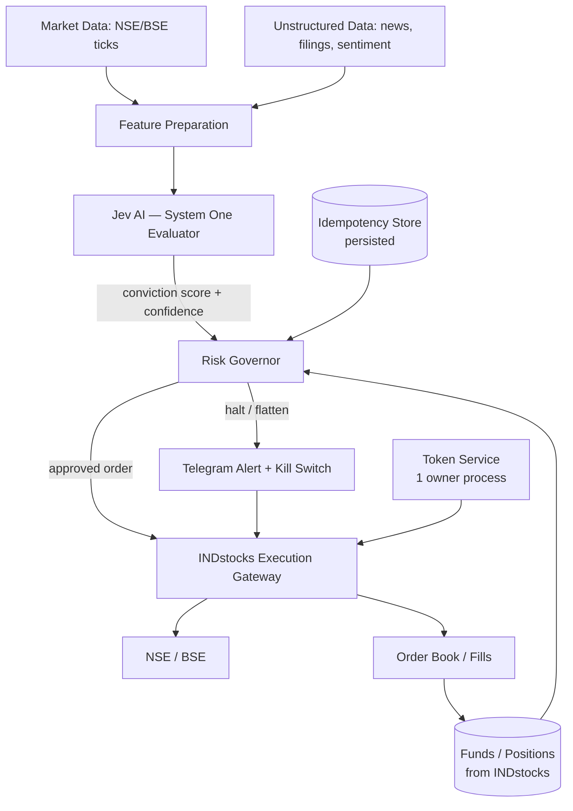

# Jev AI & INDstocks Automated Trading System
### Technical Architecture & Operational Guide — v2 (Corrected)

---

## 1. Problem Statement

Automated trading in Indian equities needs a balance between fast qualitative judgment and rigid quantitative execution. Three failure points motivate this design:

- **High-latency, uncalibrated LLM reasoning.** General chat models (GPT-4o, Claude) run 2–10s per call and are trained to sound confident, not to be calibrated. By the time a signal returns, the regime has often shifted.
- **Deterministic rigidity vs. nuanced market state.** Pure technical-indicator strategies (RSI, moving averages) can't read a news event or an earnings-call tone shift. Pure ML models drift when volatility breaks historical patterns.
- **Broker & regulatory friction.** SEBI requires static IP whitelisting for order placement, daily re-authentication, and tick-size-correct order collars. Scripts that ignore these get rejected orders or frozen accounts.
- **Operational risk.** Without an enforced (not just described) risk governor, a bug can loop into a large loss in minutes. STT, GST, SEBI turnover fees, and brokerage erode any edge that isn't sized to survive them.

**Key operational thesis (unchanged):** AI scores conviction; deterministic code owns sizing, risk, and order lifecycle.

---

## 2. What Changed From v1 — Summary

| Area | v1 (as submitted) | v2 (corrected) |
|---|---|---|
| Auth endpoint | `POST /v1/auth/login` with api_key/secret/totp | `POST /generate/token` with `x-api-key` (Client ID) header, `mpin` + `totp` body |
| Token field | `access_token` | `token` — used raw in `Authorization` header (no "Bearer" prefix) |
| Token concurrency | Cron job *and* main loop both refresh | **One** process owns token generation; others read a shared cache |
| Order endpoint | `POST /orders/place`, `symbol` field | `POST /order`, requires `security_id` (from Instruments Master), `txn_type`, `segment`, `validity`, `algo_id` |
| Price collar | Described in table, never enforced in code | Enforced in `RiskGovernor.validate_trade()` against live LTP |
| Drawdown tracking | `current_drawdown` never updated | Updated from realized + unrealized P&L via `/funds` |
| Idempotency | In-memory `set()`, lost on restart | Persisted; rebuilt from order book on startup |
| Kill switch | Cancels open orders only | Cancels orders **and** squares off open positions |
| Telegram control | Accepts commands from anyone who messages the bot | Whitelisted `chat_id` check before executing `/halt` |
| Traded instrument | `NIFTY_IDX` (not a tradable security) | Nifty futures contract or a Nifty ETF, resolved via Instruments Master |
| Tick size | `round(price, 2)` | Rounded to the instrument's actual tick size (₹0.05 for most NSE equity) |
| Jev conviction | Mocked constant `0.85`, no outcome tracking | Real API call; every score logged against the eventual trade outcome |
| Sections 11–13 | Headings only, no content | Filled in below (§8–§10) |

---

## 3. System Architecture



**Layer responsibilities**

1. **Data Ingestion & Feature Layer** — pulls ticks and unstructured context (filings, news), computes technical features, compresses context to a fixed token budget before handing it to Jev.
2. **Jev AI Evaluator** — a System One model (typed Choice / Score / Noul questions, not free text) returns a calibrated conviction score and confidence in roughly 100ms per TypeSafe's published figures. It never sees account state or issues orders.
3. **Risk Governor** — the only layer allowed to say yes to a trade. Owns sizing, drawdown tracking, price collar enforcement, and idempotency. Reads live funds/positions from INDstocks rather than trusting in-memory state.
4. **INDstocks Execution Gateway** — talks to the real API: token lifecycle, order placement, order book reconciliation, GTT brackets.
5. **Telegram Control Plane** — outbound alerts plus an authenticated inbound kill switch.

---

## 4. Risk Mitigation Framework

| Protocol | Description | Threshold / Policy | Enforced where |
|---|---|---|---|
| Price Collars | Entries and target-exits use LIMIT; stop-loss/time-exits use MARKET | LIMIT for entries/targets; reject entry if LTP (re-fetched *after* the Jev call) has moved >0.15% from the price the signal was scored at. Stop-loss and time-exits deliberately use MARKET instead — a resting LIMIT can go unfilled through a fast gap while the local store already thinks the position is closed; a protective exit prioritizes fill certainty over price control. Kill-switch flatten is also MARKET, for the same reason. | `RiskGovernor.validate_trade` (entries), `exits.py::ExitManager._execute_exit` (exits) |
| Fill Confirmation | Order acceptance ≠ order fill | Every live order is confirmed via `ExecutionGateway.wait_for_fill()` (polls the order book to a terminal state or timeout) before P&L is computed or a position is marked closed/opened. A rejected fill is never opened/kept; an ambiguous (timeout/not-found) entry fill triggers a best-effort cancel plus a critical alert and the position is never stored; an ambiguous exit fill is deliberately left tracked as still-open (no cancel attempt — cancelling a possibly-already-filled SELL is its own failure mode) with a critical alert, and `reconciliation.py` is the backstop against real drift. | `ExecutionGateway.wait_for_fill`, used in `main.py`'s entry path and `exits.py`'s exit path |
| Position Sizing | Dynamic, from live equity | Min(₹50,000, 2% of equity) | `RiskGovernor.size_order`, reads `/funds` |
| Kill Switch | Daily drawdown circuit breaker | Trigger at 2% daily loss → cancel all orders **and** square off positions (skipped in paper mode — no real API calls) | `RiskGovernor.check_drawdown`, called every loop tick |
| Rate Governance | Throttle broker + Jev calls | Respect INDstocks' published per-endpoint limits (see API Conventions) | `RateLimiter` wrapper on both clients |
| Idempotency | Prevent duplicate orders | `security_id` + 1-minute window key, persisted to disk/DB; reserved only after a confirmed fill (`mark_executed`), not at approval time | `RiskGovernor.validate_trade` / `mark_executed`, rebuilt from `/order-book` on boot via `RiskGovernor.window_key()` |
| Portfolio Risk | Cap concurrent exposure | Max concurrent positions, max deployed capital %, per-sector concentration cap | `portfolio_risk.check_portfolio_risk`, `sectors.py` |
| Tick Size | Reject invalid prices before sending | Round to instrument tick size from Instruments Master | `ExecutionGateway.place_limit_order` |
| Kill-switch auth | Only the account owner can halt via Telegram | Whitelisted `chat_id`; inbound polling runs in a background daemon thread so `/halt` is actually live | `TelegramAlertNotifier.handle_emergency`, `start_background_polling` |

---

## 5. INDstocks Authentication (Corrected)

INDstocks' real auth is TOTP + MPIN against `/generate/token`, not an api_key/secret login. Two important constraints that v1 missed entirely:

- **Only one TOTP-issued token is live at a time.** Generating a new one invalidates the last. Run token generation from exactly one process and have every other process read the cached token.
- **Static IP whitelisting is only required for order placement** (not for quotes, historical data, order book, profile, or funds), and a whitelisted IP can be changed at most once a week — set both Primary and Secondary slots up front.

```python
import os
import time
import json
import pyotp
import requests
from pathlib import Path

CLIENT_ID = os.environ["INDSTOCKS_CLIENT_ID"]      # x-api-key, from dashboard after TOTP setup
MPIN = os.environ["INDSTOCKS_MPIN"]
TOTP_SECRET = os.environ["INDSTOCKS_TOTP_SECRET"]
BASE_URL = "https://api.indstocks.com"
CACHE_PATH = Path.home() / ".indstocks" / "session_token.json"


class INDstocksAuth:
    """Owns the ONE live TOTP token for this account. Run in a single process."""

    def __init__(self):
        CACHE_PATH.parent.mkdir(mode=0o700, parents=True, exist_ok=True)

    def refresh_session(self) -> str:
        totp_code = pyotp.TOTP(TOTP_SECRET).now()
        resp = requests.post(
            f"{BASE_URL}/generate/token",
            headers={"x-api-key": CLIENT_ID, "Content-Type": "application/json"},
            json={"mpin": MPIN, "totp": totp_code},
            timeout=10,
        )
        resp.raise_for_status()
        token = resp.json()["data"]["token"]
        with open(CACHE_PATH, "w") as f:
            json.dump({"token": token, "issued_at": time.time()}, f)
        os.chmod(CACHE_PATH, 0o600)
        return token


def get_cached_token() -> str:
    """Every OTHER process reads the token this way — never regenerates it."""
    with open(CACHE_PATH) as f:
        return json.load(f)["token"]


def auth_headers() -> dict:
    return {"Authorization": get_cached_token(), "Content-Type": "application/json"}
```

Cron for the **single** refresh process only (09:00 IST, before market open):

```
0 9 * * 1-5 /usr/bin/python3 /path/to/refresh_token.py
```

---

## 6. Jev AI Evaluator (Corrected)

Jev is a System One model: it answers typed `Choice` / `Score` / `Noul` questions against a state you supply, returning calibrated probabilities — it does not generate free text. Treat its score as *calibrated on the question asked*, not as a probability of profit; that mapping only exists once you've measured it against real outcomes.

```python
import requests

JEV_API_KEY = os.environ["JEV_API_KEY"]
JEV_URL = "https://api.typesafe.ai/v1/system-one"  # confirm against current Jev docs before deploying


class JevEvaluator:
    """Typed conviction scoring — logs every call for later calibration checks."""

    def evaluate_signal(self, market_context: str) -> dict:
        payload = {
            "state": market_context,
            "questions": {
                "conviction": {
                    "type": "score",
                    "instructions": "Rate conviction that this setup is a high-probability long entry.",
                    "criteria": ["No edge", "Weak edge", "Moderate edge", "Strong edge"],
                }
            },
        }
        resp = requests.post(
            JEV_URL,
            headers={"Authorization": f"Bearer {JEV_API_KEY}"},
            json=payload,
            timeout=2,
        )
        resp.raise_for_status()
        answer = resp.json()["answers"]["conviction"]
        return {"score": answer["score"], "confidence": answer["confidence"]}
```

**Calibration discipline (new, was missing in v1):**
- Log every `(context, score, confidence, eventual P&L)` tuple to the audit trail (§9).
- Run Jev in shadow mode — scoring but not trading — for at least a few weeks of live market hours before connecting scores to order placement. Backtesting Jev against historical news is unreliable, since the model may already have seen how those events played out.
- Re-derive the "conviction ≥ 0.80" threshold from your own logged outcomes, not from the number in this doc.

---

## 7. Risk Governor & Execution Gateway (Corrected)

```python
from decimal import Decimal, ROUND_HALF_UP

TICK_SIZE = Decimal("0.05")  # confirm per-instrument via Instruments Master


def round_to_tick(price: float) -> float:
    d = Decimal(str(price))
    return float((d / TICK_SIZE).quantize(0, rounding=ROUND_HALF_UP) * TICK_SIZE)


class RiskGovernor:
    def __init__(self, daily_loss_limit_pct: float, auth_headers_fn):
        self.daily_loss_limit_pct = daily_loss_limit_pct
        self.auth_headers_fn = auth_headers_fn
        self.executed_keys = self._load_idempotency_state()

    def _load_idempotency_state(self) -> set:
        """Rebuild from the broker's own order book on startup — never trust memory alone."""
        resp = requests.get(f"{BASE_URL}/order-book", headers=self.auth_headers_fn(), timeout=10)
        resp.raise_for_status()
        keys = set()
        for order in resp.json().get("data", []):
            keys.add(f"{order['name']}_{order.get('window', '')}")
        return keys

    def get_drawdown_pct(self) -> float:
        resp = requests.get(f"{BASE_URL}/funds", headers=self.auth_headers_fn(), timeout=10)
        resp.raise_for_status()
        d = resp.json()["data"]
        equity = d["sod_balance"]
        pnl_today = d["realized_pnl"] + d["unrealized_pnl"]
        return -pnl_today / equity if equity else 0.0

    def validate_trade(self, security_id: str, live_ltp: float, scored_at_price: float,
                        conviction: float, confidence: float) -> bool:
        if self.get_drawdown_pct() >= self.daily_loss_limit_pct:
            self.flatten_all()
            return False
        if conviction < 0.80 or confidence < 0.6:
            return False
        slippage_pct = abs(live_ltp - scored_at_price) / scored_at_price
        if slippage_pct > 0.0015:
            return False
        window_key = f"{security_id}_{int(time.time() // 60)}"
        if window_key in self.executed_keys:
            return False
        self.executed_keys.add(window_key)
        return True

    def size_order(self, equity: float, price: float) -> int:
        capital = min(50_000, 0.02 * equity)
        return max(1, int(capital // price))

    def flatten_all(self):
        """Kill switch: cancel open orders AND square off open positions."""
        headers = self.auth_headers_fn()
        for order in requests.get(f"{BASE_URL}/order-book", headers=headers).json().get("data", []):
            if order["status"] in ("O-PENDING", "OPEN"):
                requests.delete(f"{BASE_URL}/order/{order['id']}", headers=headers)
        for pos in requests.get(f"{BASE_URL}/positions", headers=headers).json().get("data", []):
            if pos["net_qty"] != 0:
                side = "SELL" if pos["net_qty"] > 0 else "BUY"
                requests.post(f"{BASE_URL}/order", headers=headers, json={
                    "txn_type": side, "exchange": pos["exchange"], "segment": pos["segment"],
                    "security_id": pos["security_id"], "qty": abs(pos["net_qty"]),
                    "order_type": "MARKET", "product": pos["product"], "validity": "DAY",
                    "is_amo": False, "algo_id": "99999",
                })


class ExecutionGateway:
    def __init__(self, auth_headers_fn):
        self.auth_headers_fn = auth_headers_fn

    def place_limit_order(self, security_id: str, side: str, qty: int, price: float,
                           exchange="NSE", segment="EQUITY", product="INTRADAY"):
        order_data = {
            "txn_type": side, "exchange": exchange, "segment": segment,
            "security_id": security_id, "qty": qty,
            "order_type": "LIMIT", "limit_price": round_to_tick(price),
            "validity": "DAY", "product": product, "is_amo": False,
            "algo_id": "99999",
        }
        resp = requests.post(f"{BASE_URL}/order", headers=self.auth_headers_fn(), json=order_data, timeout=10)
        return resp.json()
```

---

## 8. Telemetry, Telegram Alerts & Authenticated Kill Switch

```python
import telebot

AUTHORIZED_CHAT_ID = int(os.environ["TELEGRAM_OWNER_CHAT_ID"])


class TelegramAlertNotifier:
    def __init__(self, token: str, chat_id: int, kill_switch_callback):
        self.bot = telebot.TeleBot(token)
        self.chat_id = chat_id
        self.kill_switch = kill_switch_callback

        @self.bot.message_handler(commands=["halt", "flatten"])
        def handle_emergency(message):
            if message.chat.id != AUTHORIZED_CHAT_ID:
                return  # silently ignore — do not confirm the bot exists to strangers
            self.kill_switch()
            self.bot.reply_to(message, "EMERGENCY: Kill-switch triggered. All positions flattened.")

    def send_critical_alert(self, text: str):
        self.bot.send_message(self.chat_id, f"\u26a0\ufe0f CRITICAL: {text}")
```

---

## 9. SEBI Compliance & Audit Trail

Every decision — scored or not — is appended to an immutable JSONL log for OTR (Order-to-Trade Ratio) review and post-hoc Jev calibration:

```json
{"ts": "2026-09-25T10:15:30.123456Z", "security_id": "2885", "jev_conviction": 0.88,
 "jev_confidence": 0.91, "otr_check": "PASS", "action": "BUY", "latency_ms": 142,
 "fill_price": null, "realized_pnl": null}
```

Update `fill_price` and `realized_pnl` once the position closes, so conviction scores can be checked against actual results — this closes the loop v1 left open.

---

## 10. Backtesting, Paper Trading & Statutory Cost Engine

Before any live capital:

1. **Cost engine first.** Model STT (0.1% delivery / 0.025% intraday sell), GST on brokerage, SEBI turnover fees, and slippage. Reject any strategy whose backtested edge doesn't clear these with margin — Jev's own inference cost ($0.042/M input tokens) is negligible by comparison.
2. **Shadow-mode Jev.** Run the evaluator against live data for several weeks, logging scores with no trades placed, before trusting the 0.80 threshold.
3. **Paper trading, 15+ trading days minimum**, with the *real* Risk Governor active (not a mock) — the drawdown tracking and idempotency logic need to be exercised under real market timing, not just unit tests.
4. **Only then** connect Jev scores to live order placement, starting at minimum size.

---

## 11. Deployment

- Docker Compose: one container owns the token-refresh cron (§5); the main trading loop and the Telegram bot run as separate containers reading the shared token cache volume.
- Egress IP must be static (AWS EIP or a reserved DigitalOcean IP) and whitelisted in both the Primary and Secondary slots on the INDstocks dashboard — remember the once-a-week change limit, so set this up well before go-live.
- A connectivity heartbeat pings `/user/profile` every 30s; on failure, alert via Telegram and, after a configurable grace period, trigger `flatten_all()` rather than leaving positions unmonitored.

---

## 12. Pre-Flight Checklist

1. Token service confirmed: one owner process, others reading cache, no double-refresh.
2. Order payload tested end-to-end against `/order` with a real `security_id` pulled from the Instruments Master — not a placeholder symbol.
3. Static IP whitelisted in both slots; confirmed via a real (small) order, not just a quotes call.
4. Risk Governor's drawdown check verified against `/funds`, not a stub.
5. Kill switch tested manually: confirms it both cancels orders and squares off positions.
6. Telegram bot rejects commands from any `chat_id` other than the owner's.
7. Idempotency store rebuilds correctly from `/order-book` after a simulated restart.
8. Jev shadow-logged for several weeks; 0.80 threshold re-validated against logged outcomes, not assumed.
9. Statutory cost model shows edge net of STT/GST/SEBI fees/brokerage.
10. Tick-size rounding verified for every instrument traded, not just the equity default.

---

*This document corrects and extends the original Jev AI & INDstocks architecture guide. Auth and order-payload details were checked against INDstocks' published API documentation (api-docs.indstocks.com) as of September 2026; re-verify against current docs before deploying, since broker APIs change.*
